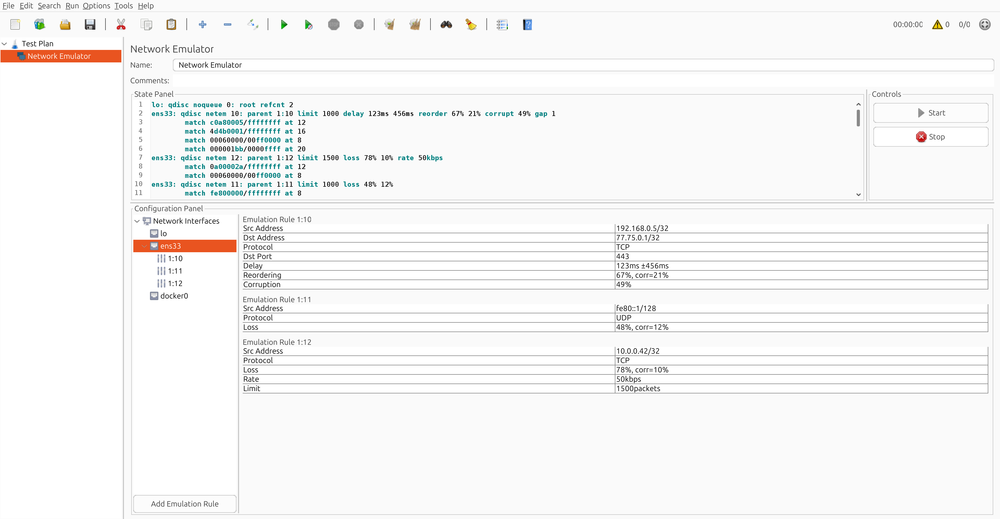
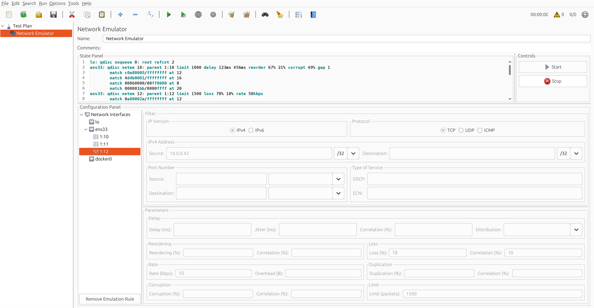

# JMeter Network Emulator

Controls network parameters like delay, jitter, corruption, or reordering directly in the Apache JMeter environment. This plugin is basically a GUI wrapper for the [`netem`](https://man7.org/linux/man-pages/man8/tc-netem.8.html) tool. It uses [`tc`](https://man7.org/linux/man-pages/man8/tc.8.html)'s built-in filter to classify packets based on their source/destination addresses, port numbers, and other fields.

**Note:** This plugin works only on Linux systems and requires root (sudo) privileges, as it relies on `tc/netem`.

## Screenshots

  
  

## Setup

Clone the project

~~~bash
git clone https://github.com/xbilek26/jmeter-network-emulator.git
~~~

Go to the project directory

~~~bash
cd jmeter-network-emulator
~~~

Build using Gradle

~~~bash
./gradlew build
~~~

Copy the JAR to JMeter (`<JMETER_HOME>/lib/ext`)

~~~bash
cp build/libs/jmeter-network-emulator.jar ~/jmeter/location/lib/ext
~~~
